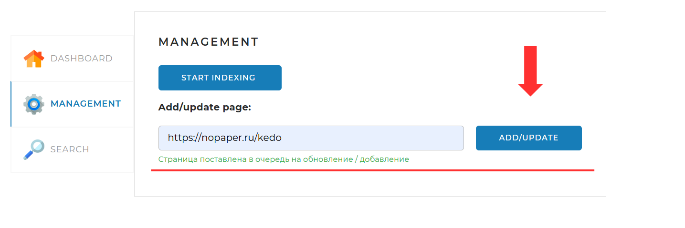
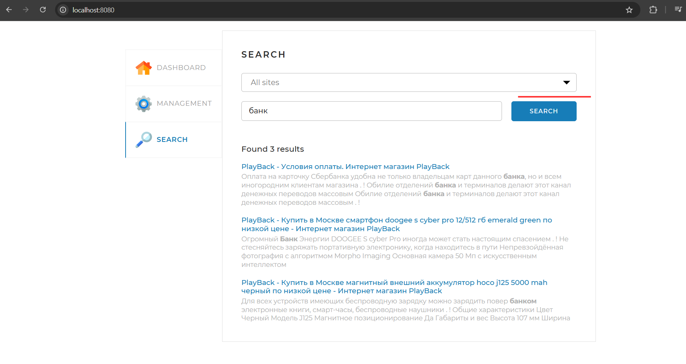

# Поисковый движок
 Проект представляет собой поисковый движок с возможностью индексации веб-страниц и выполнения поисковых запросов.

## Основные возможности
+ Индексация HTML-страниц для конкретных сайтов 
  
+ Индексация и обновление отдельной HTML-страницы
+ 
+ Можно производить поиск по всем сайтам или по конкретному сайту
+ 
+ Морфологический анализ слов (стемминг, лемматизация)
+ Ранжирование результатов по релевантности


## Технологии

+ Java 17+
+ Spring Boot
+ Postgres
+ Apache Lucene
+ Jsoup
+ Maven

## Установка и Запуск
1. Клонировать репозиторий:
```bash
git clone https://github.com/VLKasabiev/final-project
```

2. После того как вы склонировали приложение из `github` нужно открыть терминал и перейти в папку `docker`, которая находится в корне `search-engine`, и выполнить команду:
```bash
docker-compose up --build
```
⏳ Примечание: Первоначальная сборка может занять несколько минут в зависимости от скорости вашего интернет-соединения и производительности компьютера.
Вы должны увидеть в логах что posetgres и приложение успешно запустились.

После успешного запуска приложение будет доступно по адресу:
http://localhost:8080

_____


После первого успешного запуска приложения измените параметр `ddl-auto` в файле конфигурации, чтобы избежать повторного создания схемы БД при перезапусках:

1. Откройте файл конфигурации:
   ```yaml
   src/main/resources/application.yaml
Найдите параметр:

```yaml
spring:
  jpa:
    hibernate:
      ddl-auto: create
```
Измените его на:

```yaml
spring:
  jpa:
    hibernate:
      ddl-auto: update
```
Это позволит:

Сохранять существующие данные

Обновлять схему БД только при изменениях в моделях

**Важно!**
Делайте это изменение только после первого запуска, иначе таблицы не будут созданы

Для полного сброса базы данных можно временно вернуть значение create

___

1. После этого нужно перейти по http://localhost:8080 и запустить индексацию.
  
   По умолчанию проиндексируются сайты:
   + https://nopaper.ru
   + https://nikoartgallery.com
   + https://playback.ru

   Но список индексируемых сайтов можно изменить в файле application.yml:
```yaml
indexing-settings:
  sites:
    - url: https://nopaper.ru
      name: Nopaper.ru
    - url: https://nikoartgallery.com
      name: NikoartGallery.ru
    - url: https://playback.ru
      name: PlayBack
```
___
Теперь вы можете производить поиск по сайтам!


